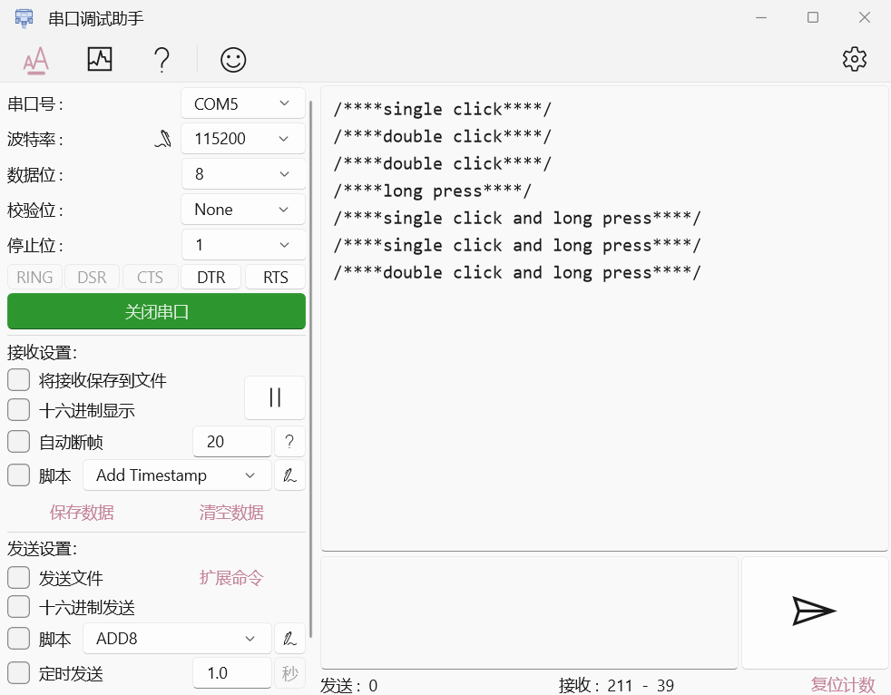

# EmbeddedButton
## 简介
EmbeddedButton是一个轻量级简单易用的嵌入式按键驱动模块，可无限拓展按键，支持多连击、长按、短按长按等多种按键事件；该模块通过异步回调方式来简化程序结构，根据几个简单原则完成了整个代码逻辑的支撑。

## 使用方法
1.定义按键实体

```c
struct button_obj_t button1;
```
2.建立键值映射表(设置回调事件)

```c
const key_value_map_t button1_map[] =
{
    {
        .key_value = SINGLE_CLICK_KV,
        .kv_func_cb = single_press_handle
    },
    {
        .key_value = LONG_PRESEE_START,
        .kv_func_cb = long_press_handle
    },
    {
        .key_value = SINGLE_CLICK_THEN_LONG_PRESS_KV,
        .kv_func_cb = single_press_then_long_press_handle
    },
};
```
3.初始化按键对象，参数含义分别为

- 按键实体
- 绑定按键的GPIO电平读取接口**read_button1_pin()**
- 设置有效触发电平
- 按键ID
- 键值映射表
- 键值映射表大小
```c
button_init(&button1, read_button1_pin, 0, 0, button1_map, ARRAY_SIZE(button1_map));
```
4. 启动按键

```c
button_start(&button1);
```
5. 设置一个5ms间隔的定时器循环调用按键后台处理函数

```c
while(1) {
    ...
    if(timer_ticks == 5) {
        timer_ticks = 0;

        button_ticks();
    }
}
```

## 特性

> 1.依靠简单几个原则，支持起整个按键判断逻辑
- 只要键值非零，时间tick++
- 只要按键状态发生变化，改变一次键值（**__append_bit()**），tick时间清零（确保tick为按下或抬起的时间）
- 以tick时间的长短及按键抬起作为一次状态结束的判断依据，可以很好的实现短按长按等操作；

> 2.使用C语言实现，巧妙利用位运算来实现每个按键键值的二进制记录表示，1代表按下，0代表松开

键值 | 说明
--- | ---
0b0 | 未按下
0b010 | 完一次单击事件
0b01010 | 双击
0b01010...n | n连击
0b011 | 长按开始事件
0b0111| 长按保持事件
0b01110|长按结束事件
0b01011|短按长按事件
0b0101011 | 双击长按事件
0b01010..n11 | n连击长按事件

> 3.利用数据驱动思想完成对应按键事件的调用：
```c
typedef struct {
    key_value_type_t key_value;
    void (*kv_func_cb)(void*);
} key_value_map_t;

const key_value_map_t button1_map[] =
{
    {
        .key_value = SINGLE_CLICK_KV,
        .kv_func_cb = single_press_handle
    },
    {
        .key_value = LONG_PRESEE_START,
        .kv_func_cb = long_press_handle
    },
    {
        .key_value = SINGLE_CLICK_THEN_LONG_PRESS_KV,
        .kv_func_cb = single_press_then_long_press_handle
    },
};

for(size_t i = 0; i < button->map_size; i++) {
    if((button->map_ptr[i].key_value == button->key_value)
    && (button->map_ptr[i].kv_func_cb))
    {
        button->map_ptr[i].kv_func_cb(button);
    }
}
```

> 4.基于面向对象方式设计思路，每个按键对象单独用一份数据结构管理：

```c
typedef struct button_obj_t {
    uint8_t  debounce_cnt : 4;
    uint8_t  active_level : 1;
    uint8_t  read_level : 1;
    uint8_t  read_level_update : 1;
    uint8_t  event_analyze_en : 1;
    uint8_t  id;
    uint16_t ticks;
    state_bits_type_t state_bits;
    key_value_type_t key_value;
    uint8_t  (*_read_button_func_ptr)(uint8_t button_id_);
    const key_value_map_t *map_ptr;
    size_t map_size;
    struct button_obj_t* next;
}button_obj_t;
```

## Examples

```c
#include "embedded_button.h"

struct button_obj_t button1;

uint8_t read_button_pin(uint8_t button_id)
{
    // you can share the GPIO read function with multiple Buttons
    switch(button_id)
    {
        case 0:
            return get_button1_value(); //Require self implementation
            break;

        default:
            return 0;
            break;
    }

    return 0;
}

void single_click_handle(void* btn)
{
    //do something...
    printf("/****single click****/\r\n");
}

void double_click_handle(void* btn)
{
    //do something...
    printf("/****double click****/\r\n");
}

void long_press_handle(void* btn)
{
    //do something...
    printf("/****long press****/\r\n");
}

void single_click_then_long_press_handle(void* btn)
{
    //do something...
    printf("/****single click and long press****/\r\n");
}

void double_click_then_long_press_handle(void* btn)
{
    //do something...
    printf("/****double click and long press****/\r\n");
}

const key_value_map_t button1_map[] =
{
    {
        .key_value = SINGLE_CLICK_KV,
        .kv_func_cb = single_click_handle
    },
    {
        .key_value = DOUBLE_CLICK_KV,
        .kv_func_cb = double_click_handle
    },
    {
        .key_value = LONG_PRESEE_START,
        .kv_func_cb = long_press_handle
    },
    {
        .key_value = SINGLE_CLICK_THEN_LONG_PRESS_KV,
        .kv_func_cb = single_click_then_long_press_handle
    },
    {
        .key_value = DOUBLE_CLICK_THEN_LONG_PRESS_KV,
        .kv_func_cb = double_click_then_long_press_handle
    }
};
...

int main()
{
    button_init(&button1, read_button_pin, 0, 0, button1_map, ARRAY_SIZE(button1_map));
    button_start(&button1);

    //make the timer invoking the button_ticks() interval 5ms.
    //This function is implemented by yourself.
    __timer_start(button_ticks, 0, 5);

    while(1)
    {}
}
```


## 其他
- 本项目基于本人实际开发中遇到的一些按键驱动使用体验问题，在他人项目（见参考链接）的思想基础上，开发的此按键驱动模块，之前提到了本模块的优势，下面说下有待改进的地方：对于多按键时组合按键的表示方式，目前还没有想到比较优雅的实现方式，后续有头绪后会进一步改进，补齐这一环。最后，感谢帮助思考我的小伙伴[shawnfeng0](https://github.com/shawnfeng0)以及正在使用此模块的小伙伴，欢迎一起开发改进！

## 参考链接
- [MultiButton](https://github.com/0x1abin/MultiButton)
- [FlexibleButton](https://github.com/murphyzhao/FlexibleButton/tree/master)
- [安富莱按键FIFO思想](https://www.armbbs.cn/forum.php?mod=viewthread&tid=111527&highlight=%B0%B4%BC%FC)