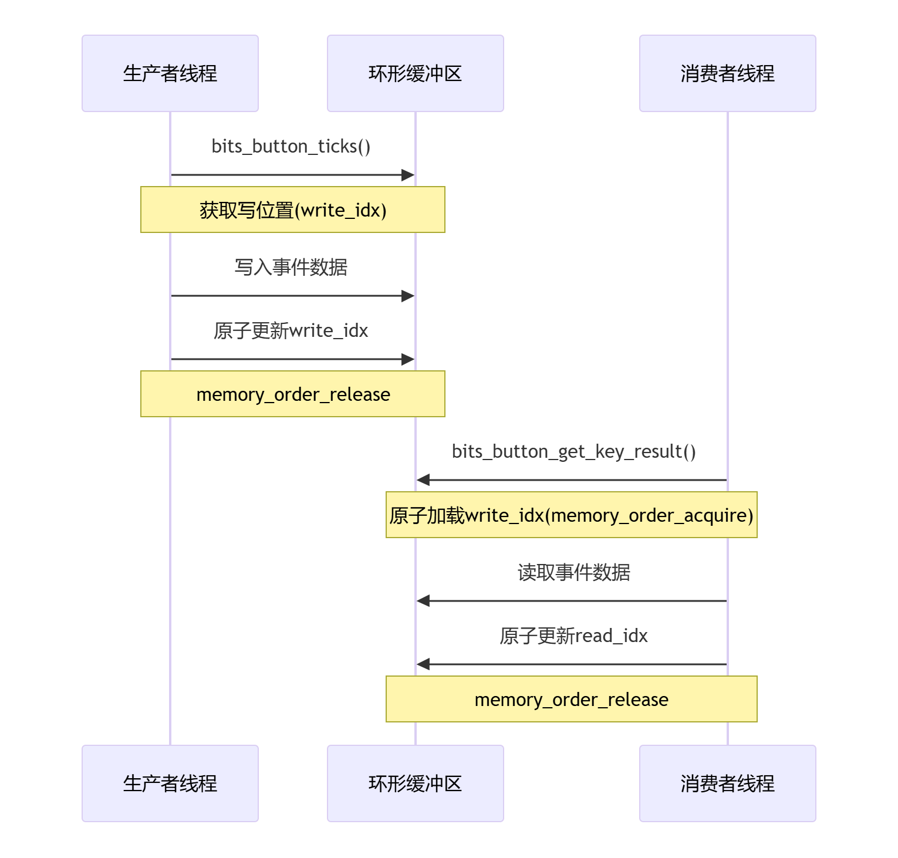

<h1 align="center">BitsButton</h1>

<p align="center">
<a href="https://github.com/530china/EmbeddedButton/blob/master/LICENSE" target="blank">

</a>
<a href="https://github.com/530china/EmbeddedButton/stargazers" target="blank">

</a>
<a href="https://github.com/530china/EmbeddedButton/issues" target="blank">

</a>
<a href="https://github.com/530china/EmbeddedButton/pulls" target="blank">

</a>
</p>

 <p text-align="">
    <a href="./docs/README_zh-CN.md">[简体中文]</a>
</p>

<h2>👋 Introduction</h2>
BitsButton is an efficient and flexible button event detection library designed specifically for embedded systems. It supports scenarios ranging from simple button detection to complex button sequence recognition, particularly suitable for applications requiring handling of combo buttons and complex button sequences.

## 🌱 Feature

> 1.**Bitwise State Representation**
Implemented in C, it cleverly uses bitwise operations to represent button states in binary format (1 = pressed, 0 = released):

Key Value | Description
--------- | -----------
0b0       | Not pressed
0b010     | Single-click
0b01010   | Double-click
0b01010...n | n-tap
0b011     | Long-press start
0b0111    | Long-press hold
0b01110   | Long-press end
0b01011   | Short-press + long-press
0b0101011 | Double-click + long-press
0b01010..n11 | n-tap + long-press

> 2.**Combo Button Support**
- Easily define any button combination (e.g., Ctrl+C)
- Intelligent handling of conflicts between combo buttons and single buttons
- Configurable suppression policy (prevent triggering single-button events within combos)

> 3.**Sequence Detection**
- Detect complex sequences (e.g., click → long-press → double-click)
- Binary encoding support (e.g., 0b1011101010)
- State-machine driven sequence recognition

> 4.**Complete Event Lifecycle**
- Press/release events
- Single/double/n-tap detection
- Long-press start/end/periodic triggers
- State completion events

> 5.**High-Performance Event Queue**
- Lock-free ring buffer (FIFO) design
- Thread-safe single-producer/single-consumer (SPSC) model
- Configurable buffer size
- Buffer overflow detection & statistics



> 6.**Modular Architecture**
- Bitwise-optimized processing logic
- State-machine driven event handling
- Atomic operation support for multi-threading

> 7.**Highly Configurable**
- Hardware abstraction layer (HAL)
- Pluggable debugging interface

## Core Data Structures

```c
// Single button object
typedef struct {
    uint16_t key_id;             // Unique button ID
    button_param_t *param;       // Button parameters
    btn_state_t current_state;   // Current state
    uint32_t state_bits;         // State sequence bitmap
} button_obj_t;

// Combo button object
typedef struct {
    uint16_t key_count;          // Number of keys in combo
    uint16_t key_single_ids[BITS_BTN_MAX_COMBO_KEYS]; // Member key IDs
    button_obj_t btn;            // Combo button state
    button_mask_type_t combo_mask; // Combo mask
    bool suppress;               // Suppress member button events?
} button_obj_combo_t;

// Button event result
typedef struct {
    uint16_t key_id;             // Triggered button ID
    btn_state_t event;           // Event type
    uint16_t long_press_period_trigger_cnt; // Long-press cycle count
    key_value_type_t key_value;  // Button value (sequence bitmap)
} bits_btn_result_t;
```

## 📋 Getting Started

### 1）How to use
<details>
<summary>Click to expand/collapse C code</summary>

- [Callback-based usage](../examples/example_callback.c);
- ​[​Polling-based usage](../examples/example_poll.c);

<br></details>

### 2）Debug

<details>
<summary>Click to expand/collapse</summary>

- Register your custom print function during initialization:
```c
int my_log_printf(const char* format, ...) {
    va_list args;
    va_start(args, format);
    int result = vprintf(format, args);
    va_end(args);
    return result;
}

bits_button_init(
    btns,
    ARRAY_SIZE(btns),
    btns_combo,
    ARRAY_SIZE(btns_combo),
    read_key_state,
    bits_btn_result_cb,
    my_log_printf
);
```
<br></details>

## ⚡ Additional Information
- This project originated from practical challenges encountered during embedded button driver development. Inspired by open-source projects (see References), it was developed with valuable insights from contributor [shawnfeng0](https://github.com/shawnfeng0).Contributions are welcome!
- Advanced usage examples [Button Simulator](./examples/ButtonSimulator.md)

TODO:
- [ ] Button Simulator support linux env；
- [ ] Add automated test support

## 💬 Reference links
- [MultiButton](https://github.com/0x1abin/MultiButton)
- [FlexibleButton](https://github.com/murphyzhao/FlexibleButton/tree/master)
- [armfly](https://www.armbbs.cn/forum.php?mod=viewthread&tid=111527&highlight=%B0%B4%BC%FC)
- [easy_button](https://github.com/bobwenstudy/easy_button#)
